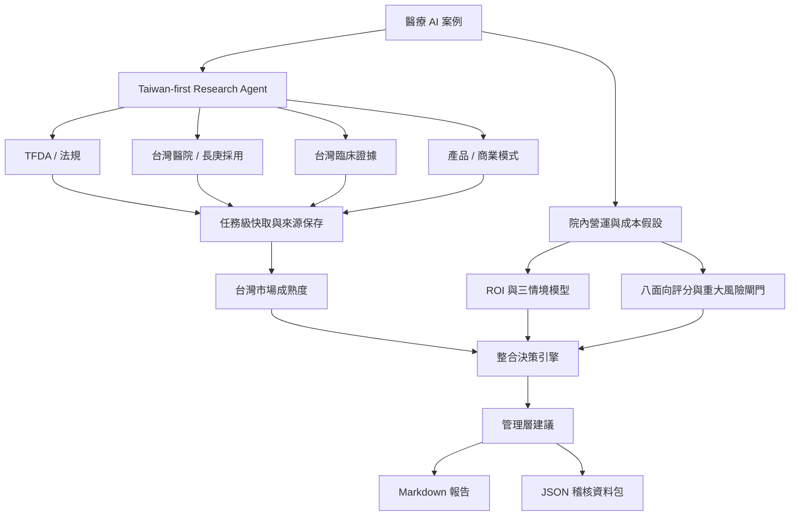

# Hospital AI Value Assessment Agent

A Taiwan-first decision-support prototype for evaluating whether a medical AI project is commercially and operationally suitable for Linkou Chang Gung Memorial Hospital.

> This project supports market and business feasibility assessment. It does not provide medical diagnosis or treatment advice.

## Why this project exists

Hospitals often evaluate medical AI with fragmented information: product claims, regulatory status, clinical papers, integration requirements, license costs, workflow impact, and internal governance risks. A promising model can still fail commercially if the hospital cannot integrate it, clinicians do not adopt it, or the economics do not hold under conservative assumptions.

This project turns those questions into a traceable workflow:

1. Research Taiwan-specific evidence.
2. Calculate financial impact and scenario sensitivity.
3. Evaluate operational, regulatory, data, integration, and adoption risks.
4. Combine the evidence into a decision recommendation.
5. Produce a source-backed management report and audit JSON.

## Key features

### Taiwan-first Research Agent

The agent executes four independent research tasks:

- TFDA and Taiwan regulatory research
- Taiwan hospital adoption and public Chang Gung cases
- Taiwan clinical evidence
- Products available in Taiwan, business models, and integration requirements

Each task has independent cache and error handling. A technical failure is not interpreted as missing market evidence.

### Hospital financial model

- Annual labor savings
- Annual total benefit
- First-year net benefit
- Three-year ROI
- Estimated payback period
- Conservative, baseline, and optimistic scenarios

### Feasibility and risk assessment

Eight weighted dimensions:

- Cost-saving potential
- Efficiency improvement
- Revenue potential
- Clinical value
- Data readiness
- Integration feasibility
- Regulatory control
- Clinical adoption readiness

Major risk gates prevent a high financial score from automatically becoming an approval recommendation.

### Integrated decision engine

The formal decision combines:

| Decision pillar | Weight |
|---|---:|
| Taiwan market maturity | 30% |
| Linkou Chang Gung internal feasibility | 40% |
| Financial resilience | 30% |

Regulatory blockers, multiple internal risk gates, and non-positive ROI can override the weighted score.

### Management outputs

- Source-backed management report in Markdown
- Complete decision and audit package in JSON
- Public-source appendix
- Product comparison table
- Data-gap and next-action list

## System architecture



A larger version is available in [`docs/SYSTEM_FLOW.md`](docs/SYSTEM_FLOW.md).

## Preset use cases

- Emergency chest X-ray AI for prioritization and assisted interpretation
- Generative AI for inpatient chart summarization
- Outpatient appointment and customer-service AI

## Tech stack

- Python
- Streamlit
- OpenAI Responses API and Web Search
- Pydantic structured outputs
- pandas
- Local JSON task cache

## Project structure

```text
.
├── app.py                    # Streamlit entrypoint
├── research_agent.py         # Taiwan-first research workflow
├── research_ui.py            # Research interface
├── scoring.py                # Financials, score aggregation, risk gates
├── assessment_rules.py       # Automatic feasibility scoring rules
├── scenario_analysis.py      # Conservative / baseline / optimistic scenarios
├── integrated_decision.py    # Integrated hospital decision logic
├── ai_report.py              # Management narrative and report builder
├── requirements.txt
├── DEPLOYMENT.md
└── docs/
    └── SYSTEM_FLOW.md
```

## Local setup

```bash
python -m venv .venv
source .venv/bin/activate
pip install -r requirements.txt
```

Create a local `.env` file:

```env
OPENAI_API_KEY=sk-your-key
OPENAI_RESEARCH_MODEL=gpt-4.1-mini
OPENAI_REPORT_MODEL=gpt-4.1-mini
```

Run:

```bash
python -m streamlit run app.py
```

## Recommended demo flow

1. Select the emergency chest X-ray preset.
2. Load or run the four Taiwan research tasks.
3. Review Taiwan maturity, products, clinical evidence, and data gaps.
4. Run the hospital assessment using the default assumptions.
5. Review conservative, baseline, and optimistic scenarios.
6. Review the integrated Linkou Chang Gung recommendation.
7. Generate and download the management report and audit JSON.

## Design principles

- Taiwan evidence is not replaced by US or European evidence.
- Technical failure is separated from evidence absence.
- Company claims are separated from independent clinical evidence.
- Unknown prices and unpublished hospital information are not invented.
- AI writes the management narrative, but Python owns calculations and decisions.
- Reports preserve source links and structured audit data.

## Current limitations

- Public data may not reveal private hospital pilots, contracts, procurement prices, or internal KPIs.
- Local file cache is not a durable production database.
- Financial outputs depend on user-provided assumptions and are not guarantees.
- Regulatory research is an initial public-data review, not formal legal or TFDA advice.
- The prototype does not connect directly to hospital HIS, PACS, RIS, or EMR systems.

## Future improvements

- Durable database and reviewed research snapshots
- User authentication and role-based access
- Supplier questionnaire workflow
- Automated source freshness checks
- PDF or DOCX board-report export
- Direct integration with hospital data and procurement systems
- Evaluation tracing and regression tests for agent outputs

## Deployment

See [`DEPLOYMENT.md`](DEPLOYMENT.md) for Streamlit Community Cloud instructions.
