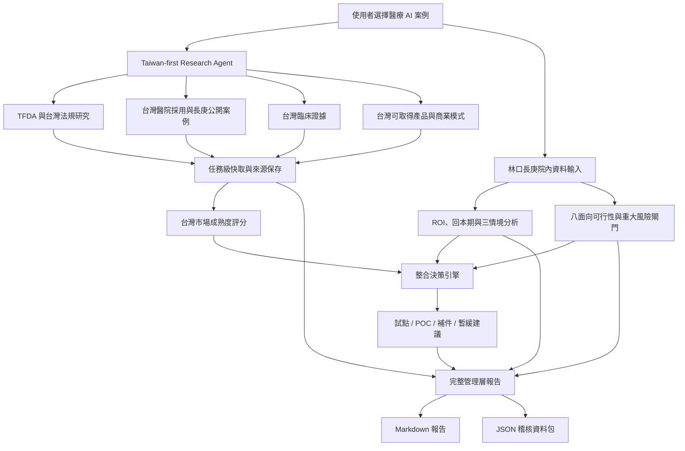

# System Flow

```mermaid
flowchart TD
    A[使用者選擇醫療 AI 案例] --> B[Taiwan-first Research Agent]

    B --> B1[TFDA 與台灣法規研究]
    B --> B2[台灣醫院採用與長庚公開案例]
    B --> B3[台灣臨床證據]
    B --> B4[台灣可取得產品與商業模式]

    B1 --> C[任務級快取與來源保存]
    B2 --> C
    B3 --> C
    B4 --> C

    C --> D[台灣市場成熟度評分]
    A --> E[林口長庚院內資料輸入]
    E --> F[ROI、回本期與三情境分析]
    E --> G[八面向可行性與重大風險閘門]

    D --> H[整合決策引擎]
    F --> H
    G --> H

    H --> I[試點 / POC / 補件 / 暫緩建議]
    I --> J[完整管理層報告]
    C --> J
    F --> J
    G --> J

    J --> K[Markdown 報告]
    J --> L[JSON 稽核資料包]
```

## Decision pillars

- 台灣市場成熟度：30%
- 林口長庚院內可行性：40%
- 財務韌性：30%

重大法規、院內風險與負 ROI 可限制最終決策，系統不會只看加權總分。
